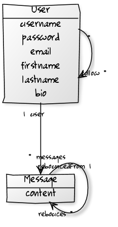

I recently had some time to learn a bit more about angulars, docker and nodejs rest api while building [Plop-Sync](https://plop.io/sync/). I made some mistakes (which I hopfully fix).

I'll try to sumarize all the thing a learn about building a clean REST Api with nodejs, restify and mongoose.

First, I learn a lots thank to [Vinay Sahni and his awesome article about REST Api](http://www.vinaysahni.com/best-practices-for-a-pragmatic-restful-api).


### Summary

Part 1

 1. Intro

 2. Design

    2.1. Data model

    2.2. RESTfull resources

 3. Let's code

    3.1 Seting up the project

    3.2 Seting up basic Message model

    3.3 Seting up basic Messages routes controller

    3.4 Server bootstrap and routes wireing

 10. References

Introduction
---------------

Lets say we want to  build something like twiter with users, messages, users folow each other and messages can be "rebounced" but with a single page WebApp (maybe with angularjs) and a separate REST Api.

2. Design
----------

### 2.1. Data model

So, Twiter right ? Lets design the data model.

We need users... and messages. 

 * Each user can have multiple messages.
 * Each message is published by a user.
 * Users follow each other
 * Message can be rebounce



```javascript

User: {
    id:       'ObjectId'
    username: 'string',
    password: 'string',
    email:    'string',
    firstname:'string',
    lastname: 'string',
    bio:      'string',
    follow:   ['ObjectId'] // users followed
}

Message: {
    content:       'string',
    user:          'ObjectId', // Owner 
    rebounced:     'ObjectId', // Origin message for rebounce
    createdOn:     'date',
    lastUpdatedOn: 'date'

}
```

### 2.2. RESTflull resources

RESTfull Api are seperated in logical resources (moun) making sens for the api consumer ([more detailed definition](http://www.vinaysahni.com/best-practices-for-a-pragmatic-restful-api#restful)).

Lets defined Users and Messages resources


#### Basic CRUD methods
```
GET  /users/:id             // get user details
POST /users                 // create new user
PUT  /users/:id             // Update user details
DEL  /users/:id             // delete user

GET  /messages              // get all messages
GET  /messages/:id          // get message details
POST /messages              // send a new message
PUT  /messages/:id          // update message details
DEL  /messages::id          // delete messages
```

#### Relationships
```
GET /users/:id/messages     // get user messages
GET /messages/:id/users     // get users who rebounce a message
```

#### Custom actions
```
POST /users/:id/login       // user login
GET  /users/:id/feed        // get user feed (messages from followed users)
GET  /messages/:id/rebouce  // rebouce a message
```


3. Let's code
------------

#### 3.1. Seting up the project

First let's start the project.

```bash
mkdir rest-api
cd rest-api

# create default package.json
npm init

# install mongoose and restify in the project and save to package.json
npm install --save mongoose restify

# install bcrypt module to hash passwords
npm install --save bcrypt

# install async (helper function for working with asynchronous JavaScript)
npm install --save async

# create basic files structure
mkfir -p app/models app/routes/messages app/routes/users tests

touch app/server.js
```

Basic files structure look like this :
```
├── app
│   ├── models
│   ├── routes
│   │   ├── messages
│   │   └── users
│   └── server.js
├── tests
└── package.json
```

Models are located in`app/models/ModelName.js`, routes controllers in `app/routes/resourcesName/actionName.js`.

Finaly, `app/server.js` is the app entry point where everythings is bootstraped.


#### Seting up basic Message data model

```javascript
// app/model/Message.js

// loading mongoose module
var mongoose = require('mongoose');
var Schema = mongoose.Schema;


// Defined Message schema
var messageSchema = new Schema({
    content:       { type: String, require: true},
    rebouncedFrom: { type: Schema.Types.ObjectId, ref: 'Message' },
    createdOn:     { type: Date, default: Date.now},
    lastUpdatedOn: { type: Date, default: Date.now}
});

// Create Message model
var Message = mongoose.model('Message', messageSchema);

// exports Message model
module.exports = Message;
```

#### Seting up basic routes controllers

Each route is wire to a controller. 

The 5 basic CRUD controller for Messages look like this.

```javascript
// *********************************
// ** app/routes/messages/list.js **
var restify = require('restify');
var Messages = require('../../models/Messages');

module.exports = function(req, res, next) {

    Messages.find({}, function(err, messages) {
        if (err) {
            // loging errors
            console.error('InternalError :', err);
            // returning generic InternalError to clients
            return next(new restify.InternalError());
        }

        res.send(messages);
    });
}

// ************************************
// ** app/routes/messages/details.js **
var restify = require('restify');
var Messages = require('../../models/Messages');

module.exports = function(req, res, next) {

    if (!req.params('id')) {
        return next(new restify.MissingParameterError('Missing :id param'))
    }

    Messages.findById(req.params('id'), function(err, message) {
        if (err) {
            // loging errors
            console.error('InternalError :', err);
            // returning generic InternalError to clients
            return next(new restify.InternalError());
        }

        // returning ResourceNotFoundError (error 404)
        if (!message) { return next(new restify.ResourceNotFoundError()); }

        // returning message on success
        res.send(message);
    });
}

// ***********************************
// ** app/routes/messages/update.js **
var restify = require('restify');
var Messages = require('../../models/Messages');

module.exports = function(req, res, next) {

    if (!req.params('content')) {
        return next(new restify.MissingParameterError('Missing :content param'))
    }

    Messages.findByIdAndUpdate(req.params('id'),
        {
            content: req.params('content'), // update content
            lastUpdatedOn: Date.now()       // change lastUpdate date
        },
        function(err, message) {
            if (err) {
                // loging errors
                console.error('InternalError :', err);
                // returning generic InternalError to clients
                return next(new restify.InternalError());
            }

            // returning ResourceNotFoundError (error 404)
            if (!message) { return next(new restify.ResourceNotFoundError()); }

            // returning update message on success
            res.send(message);
        }
    );
}

// ***********************************
// ** app/routes/messages/delete.js **
var restify = require('restify');
var Messages = require('../../models/Messages');

module.exports = function(req, res, next) {
    
    Messages.findByIdAndRemove(req.params('id'), function(err, message) {
        if (err) {
            // loging errors
            console.error('InternalError :', err);
            // returning generic InternalError to clients
            return next(new restify.InternalError());
        }

        // returning ResourceNotFoundError (error 404)
        if (!message) { return next(new restify.ResourceNotFoundError()); }

        // returning deleted message on success
        res.send(message);
    });
}

// ***********************************
// ** app/routes/messages/create.js **
var restify = require('restify');
var Messages = require('../../models/Messages');

module.exports = function(req, res, next) {

    if (!req.params('content')) {
        return next(new restify.MissingParameterError('Missing :content'));
    }

    var message = new Messages({
        content: req.params('content')
    });

    message.save(function(err, message) {
        if (err) {
            // loging errors
            console.error('InternalError :', err);
            // returning generic InternalError to clients
            return next(new restify.InternalError());
        }

        // returning message on success
        res.send(message);
    })
}

```

#### 3.4 Server bootstrap and routes wireing

And we need to wire this in `app/server.js`


```javascript
// *******************
// ** app/server.js **
var restify = require('restify');
var mongoose = require('mongoose');


// connect to mongodb database rest-api on localhost
mongoose.connect('mongodb://localhost/rest-api')


// create restify server named 'rest-api'
var server = restify.createServer({
    name: 'rest-api',
});

// seting up Messages basic CRUD routes
server.get('/messages',     require('./routes/messages/list'));
server.get('/messages/:id', require('./routes/messages/details'));
server.put('/messages/:id', require('./routes/messages/update'));
server.del('/messages/:id', require('./routes/messages/delete'));
server.post('/messages/:id', require('./routes/messages/create'));

// start listening on port 1337
server.listen(1337);
```

### Checking everything is working

We can check if everything is working properly with curl
```bash
# start the server
node app/bootstrap.js


curl http://localhost:1337/messages
# => [];


```


References
--------------

[Best Practices for Designing a Pragmatic RESTful API](http://www.vinaysahni.com/best-practices-for-a-pragmatic-restful-api) by Vinay Sahni

[Nodejs](http://nodejs.org)

[Restify](http://mcavage.me/node-restify/)

[Mongoose](http://mongoosejs.com/)

[MongoDB](http://www.mongodb.org/)
